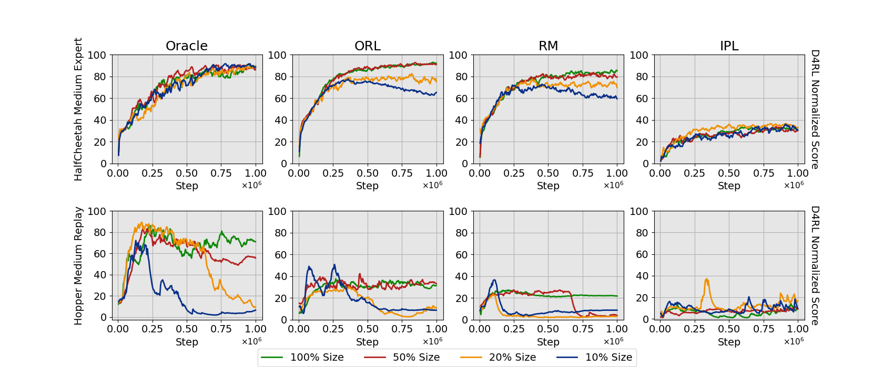

# Binary Reward Labeling

This repository is based on the [CORL library](https://github.com/tinkoff-ai/CORL).

## Installation

Set up and install the d4rl environments by following the instructions provided in the [d4rl documentation](https://github.com/Farama-Foundation/D4RL) until you can successfully run `import d4rl` in your Python environment.

Clone the GitHub repository and install required packages:

```bash
git clone https://github.com/uiuc-focal-lab/ORL.git && cd ORL
pip install -r requirements/requirements_dev.txt
```

## Initialize Wandb

Initialize Wandb by running the following command inside the folder:

```bash
wandb init
```

Follow the prompts to create a new project or connect to an existing one. Make sure you have the necessary API key and project settings configured, and update the `project` argument.

For more information on how to use Wandb, refer to the [Wandb documentation](https://docs.wandb.ai/).

## Generate Preference Datasets

Run the shell files. They will be written into the `saved` folder.

```bash
. generate_pbrl_datasets.sh
. generate_pbrl_datasets_no_overlap.sh

```
## Run Example

Run the sample Python command. Make sure you have the necessary dependencies installed and the Python environment properly configured.

```bash
. example.sh
```
## Full Experiment and Ablation Study Scripts

To run the full experiment and ablation study, use the following scripts:

- `main.sh`: Contains commands for the full experiment.
- `abl.sh`: Contains commands for the ablation study.


Execute these scripts in your terminal:


```bash
. main.sh
```

```bash
. abl.sh
```

## Experiment Results

### Main Experiments

Training log of learning with different methods on different datasets: Oracle True Reward, ORL, Latent Reward Model, and IPL with True Reward


### Ablation Studies

Training log of learning with a method on datasets of different sizes



Comparison between the learning efficiency of ORL combined with different standard offline RL algorithms


Comparison between the cases where single or multiple preference labels are given to each pair of trajectories


Comparison between datasets with different settings of structured overlapping trajectories


